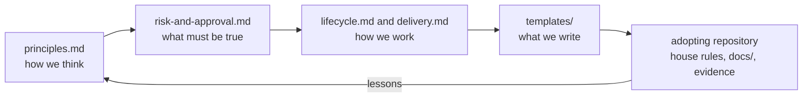

# Gauss Playbook

The engineering playbook for the **FoodBear-Gauss** team: how we frame, build,
verify, release and operate software, written once so that engineers and coding
agents work the same way in every repository.

The team is named after Carl Friedrich Gauss, one of the greatest mathematicians
of all time. His motto, *pauca sed matura* ("few, but ripe"), is how we want to
ship: small changes, finished and proven.

## Start here

| If you are | Read |
|---|---|
| A coding agent, or directing one | [`AGENTS.md`](AGENTS.md) |
| New to the team | [`principles.md`](principles.md), then [`lifecycle.md`](lifecycle.md) |
| About to touch anything that writes to a live platform | [`risk-and-approval.md`](risk-and-approval.md) |
| Opening or reviewing a pull request | [`delivery.md`](delivery.md) |
| Starting a document | [`templates/`](templates/README.md) |
| Bringing a repository onto the playbook | [`adopt/`](adopt/README.md) |
| Unsure what a word means | [`glossary.md`](glossary.md) |

## How it fits together



**Precedence.** The adopting repository's house rules win for local facts. This
playbook adds structure; it never overrides them.

## What does not belong here

This repository is **public**. Client-confidential material, house rules, store
names, prices, rates, credentials and customer data live in the adopting
repository. `scripts/check.py` blocks the obvious cases.

## Source

Adapted from the AI Engineering Playbook (Ta Khongsap), main at commit `5ba9dc8`,
cut down to what the team needs and specialized for push-lane work.

## Checks

```bash
python3 scripts/check.py
```

See [`TESTING.md`](TESTING.md). Changes are recorded in [`CHANGELOG.md`](CHANGELOG.md);
open work and evidence in [`DEVLOG.md`](DEVLOG.md).
