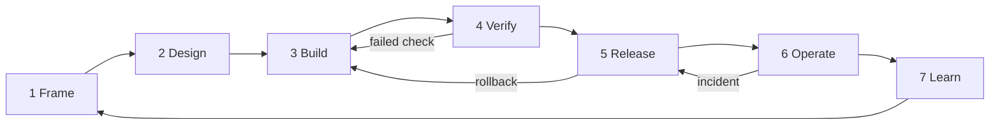

# Delivery Lifecycle

Every phase leaves an artifact. A gate is a decision made on evidence, not a
meeting and not the fact that a document exists. Scale the depth to the risk tier
([`risk-and-approval.md`](risk-and-approval.md)): an R0 spike needs a scope note;
an R3 change needs everything below.

| Phase | What must be true at the gate | Artifact |
|---|---|---|
| **1. Frame** | We can say who it is for, what success means, what must not happen, and who accepts the remaining risk. | [`intent.md`](templates/intent.md), growing into a [`prd.md`](templates/prd.md) when substantial |
| **2. Design** | Assumptions, interfaces, failure modes, the approval boundary and how we will verify are reviewable. Unknowns have an owner. | [`spec.md`](templates/spec.md), [`threat-model.md`](templates/threat-model.md), [ADRs](templates/adr.md) |
| **3. Build** | The slice runs with known inputs and observable outputs. No hidden fallback covers a missing piece. | [`plan.md`](templates/plan.md), written before the code |
| **4. Verify** | Required checks pass, including failure and rollback paths. Severe findings are fixed or accepted by the owner in writing. | The pull request, [`review.md`](templates/review.md), [`coverage-sheet.md`](templates/coverage-sheet.md) |
| **5. Release** | The operator knows what is running where, can detect a bad release, and can stop or roll it back. | [`runbook.md`](templates/runbook.md), release note |
| **6. Operate** | Behavior stays inside the agreed envelope; otherwise degrade, disable or roll back. | [`weekly-report.md`](templates/weekly-report.md), [`incident-record.md`](templates/incident-record.md) |
| **7. Learn** | Each incident, near miss or repeated mistake changed a test, template or rule. | CHANGELOG, DEVLOG, an `AGENTS.md` line |

## Where the documents live

Project documents (intent, PRD, spec, plan, ADRs, threat model, runbook) live in
the repository they describe, under `docs/`. This playbook holds only the
templates and the shared rules. See [`adopt/`](adopt/README.md).

## Verification in practice

- Deterministic tests for the code.
- Fault checks: kill the network, expire the login, return a rate limit, and
  confirm the run fails with a reason and leaves nothing half written.
- Dry-run checks: the plan shown before a push matches what a live push would
  write.
- Live checks on test stores only, each with a go, a restore and a re-read.
- One rollback exercised before a release reaches every machine.

Record what ran, what was skipped and why. A skipped check that is not written
down looks exactly like a pass.
